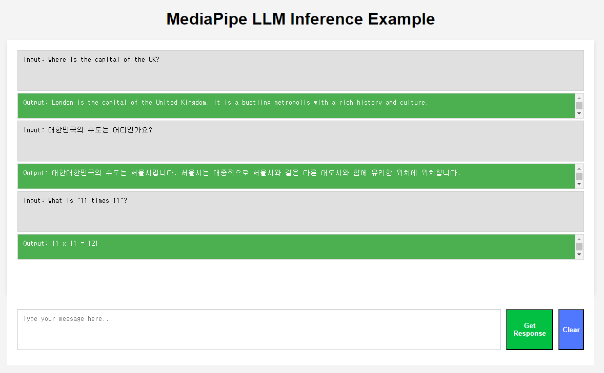
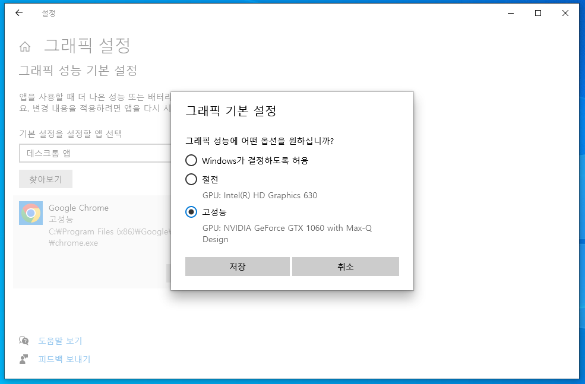
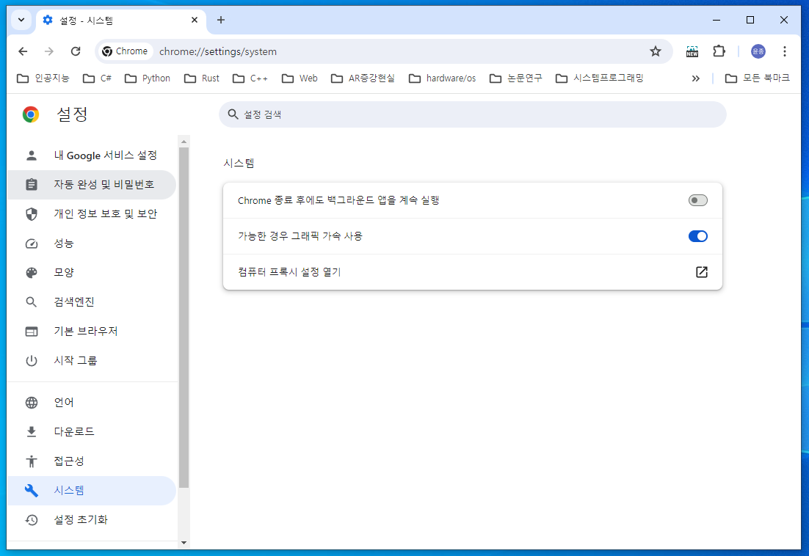
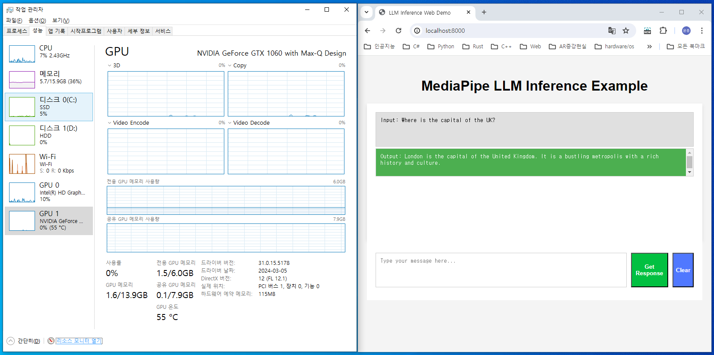

# On-device LLM Inference using MediaPipe API

## 개요

구글 미디어파이프(MediaPipe)는 ML/DL 애플리케이션 생성을 위한 다양한 도구를 제공한다. 2024년 5월 미디어파이프는 온-디바이스에서 대규모언어모델(LLM) 실행을 위한 API를 제공하기 시작하였다. 이제 LLM 서빙을 위한 서버를 구축하지 않더라도 모바일 장치 등에서 맞춤형 언어모델을 실행할 수 있고, 이를 활용한 애플리케이션을 제작하기가 더 쉬워질 것이다. <br>
여기에서는 웹 브라우저에서 MediaPipe LLM API를 실행하는 text-generation 공식예제를 변형하여, 간단한 챗UI에서 LLM모델을 실행시켜본다. 크롬의 하드웨어 가속을 허용한 상태에서 텍스트 생성은 상용 LLM 서비스 모델 못지않게 빠른 사용자 경험을 제공한다.<br>
기타 자세한 내용은 [링크](https://hayunjong83.tistory.com/62)를 참조한다.

## 실행 방식

1. Kaggle의 [Gemma 모델 페이지](https://www.kaggle.com/models/google/gemma/tfLite/)에서 gemma-2b-it-gpu-int4 모델을 다운로드 받는다.
2. 터미널 또는 명령 프롬프트 등을 실행하여, 다음 명령어를 이용하여, 간단한 테스트 서버를 실행시킨다.
```shell
python -m http.server 8000
```
3. Chrome 또는 Edge 처럼 WebGPU 지원이 되는 브라우저를 열고 [localhost:8000](http://localhost:8000)으로 접속한다.

## 실행 결과 예시


## 참고 사항

- 다른 모델을 사용할 때는 <code>index.js</code>에서 <code>modelFileName</code>에 해당 모델 파일의 경로를 입력한다.
- 현재 구글의 Gemma 모델 이외에 Falcon, StableLM, Phi-2 등의 모델을 지원한다.
    + (참고-[Models](https://ai.google.dev/edge/mediapipe/solutions/genai/llm_inference))
- Kaggle의 Gemma 모델이 아닌 위의 모델을 HuggingFace에서 받아서 사용할 경우에는, 해당 TfLite 모델을 MediaPipe에서 사용할 수 있는 형태로 추가 변환이 필요한다.
    + (참고-[Convert model to MediaPipe format](https://ai.google.dev/edge/mediapipe/solutions/genai/llm_inference#convert-model))
- 직접 fine-tuned 모델을 사용할 경우라면, 우선 AI Edge를 이용하여 TfLite 파일로 변환한 후, 위의 과정을 진행한다.
    + (참고-[AI Edge Torch](https://github.com/google-ai-edge/ai-edge-torch))
- 웹 브라우저에서 Inference API를 사용할 때는 WebGPU를 지원하는 브라우저를 사용하여야 한다.
    + (참고-[GPU browser compatibility](https://developer.mozilla.org/en-US/docs/Web/API/GPU#browser_compatibility))
- 외장 그래픽 카드가 있음에도 추론 속도가 빠르지 않다면, (Windows, Chrome의 경우) 앱별 그래픽카드 설정과 브라우저의 하드웨어 가속 설정을 확인한다.
    + 
    + 
- 4bit로 양자화된 gemma-2b 모델(<code>gemma-2b-it-gpu-int4.bin</code>)의 경우, 약 1.5 GB의 GPU메모리를 사용하는 경량 실행이 가능하였다.
    + 

## 참고 링크

- [LLM Inference Guide for edge devices](https://ai.google.dev/edge/mediapipe/solutions/genai/llm_inference)
- [Mediapipe LLM Inference task for web](https://github.com/google-ai-edge/mediapipe-samples/tree/main/examples/llm_inference/js)
